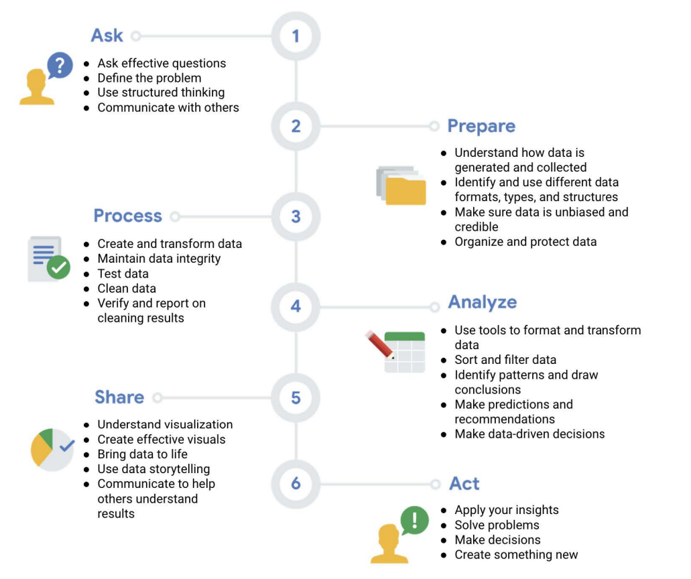

# Week 3

## The right data analysis tools

* Spreadsheets
* Databases
* Query Languages
* Visualization Software

## Life cycle of data

* **Plan**: Business decides upon the kind of data needed, how it will be managed, who will be responsibe for it, and the optimal outcomes.
* **Capture**: Data is collected from a variety of sources. *Ensure data integrity, credibility, and privacy.*
* **Manage**: How and where the data is stored, the tools used to keep it safe, and the actions taken to make sure it's maintained properly. *Important phase for data cleansing.*
* **Analyze**: *Data analyst work.* The data is used to solve problems, make great decisions, and support business goals.
* **Archive**: Storing data in a place where it's still available, but may not be used again.
* **Destroy**: Secure data erasure software. Shred paper files. 

**Data life cycle** - Plan, Capture, Manage, Analyze, Archive, and Destroy. 

**Data analysis life cycle** - Ask, Prepare, Process, Analyze, Share, and Act. 

The data life cycle involves stages for identifying needs and managing data. Data analysis involves process steps to make meaning from data.Individual stages in the data life cycle will vary from company to company or by industry or sector. Although data life cycles vary, one data management principle is universal. Govern how data is handled so that it is accurate, secure, and available to meet your organization's needs.

## Phases of data analysis

**Ask** - Define the problem that needs to be solved and understand the stakeholder's expectations. 
-   *Define the problem* - Look at the current state and identify how it's different from the ideal state.
-   *Stakeholder* - Determine who it is. Eg., Manager, executive sponser, sales partner, etc. 

**Prepare** - Collect and store the data to be used for the upcoming analysis. 

**Process** - Find and eliminate any errors and inaccuracies that can get in our way of results. Involves cleaning data, transforming it into a more useful format, comine data sets to complete information, and remove outliers. Make sure that the data is complete and correct. 

**Analyze** - Use tools to transform and organize the information so that useful conclusions can be drawn, predictions can be made, and aid in informed decision-making. *In this course - Spreadsheets and SQL.*

**Share** - Intrepret results and share them with others to help stakeholders make effective data-driven decisions. Use visualizations. *In this course - R.*

**Act** - Use the insights provided by the data analyst to solve the original business problem. 

****

**What is the relationship between the data life cycle and the data analysis process? How are the two processes similar? How are they different?**
-   While the data analysis process will drive your projects and help you reach your business goals, you must understand the life cycle of your data in order to use that process. To analyze your data well, you need to have a thorough understanding of it. Similarly, you can collect all the data you want, but the data is only useful to you if you have a plan for analyzing it.

**What is the relationship between the Ask phase of the data analysis process and the Plan phase of the data life cycle? How are they similar? How are they different?**
-   The Plan and Ask phases both involve planning and asking questions, but they tackle different subjects. The Ask phase in the data analysis process focuses on big-picture strategic thinking about business goals. However, the Plan phase focuses on the fundamentals of the project, such as what data you have access to, what data you need, and where you’re going to get it.

## Data Analyst's Toolbox

* Spreadsheets: A digital database. Spreadsheets structure data in a meaningful way by letting you 
    -   Collect, store, organize, and sort information
    -   Identify patterns and piece the data together in a way that works for each specific data project
    -   Create excellent data visualizations, like graphs and charts. 
* Query Languages: A computer programming language that allows you to retrive and manipulate data from a database. **S**tructured **Q**uery **L**anguage. Query languages 
    -   Allow analysts to isolate specific information from a database(s)
    -   Make it easier for you to learn and understand the requests made to databases
    -   Allow analysts to select, create, add, or download data from a database for analysis
* Visualization Tools: Graphical represntation of information. Tableau, Looker. These tools 
    -   Turn complex numbers into a story that people can understand 
    -   Help stakeholders come up with conclusions that lead to informed decisions and effective business strategies  
    -   Have multiple features 
        -   Tableau's simple drag-and-drop feature lets users create interactive graphs in dashboards and worksheets 
        -   Looker communicates directly with a database, allowing you to connect your data right to the visual tool you choose 

**Spreadsheets** | **Databases** 
--- | --- 
Software applications   |   Data stores - accessed using a query language (e.g. SQL)
Structure data in a row and column format   |   Structure data using rules and relationships
Organize information in cells   |   Organize information in complex collections
Provide access to a limited amount of data  |   Provide access to huge amounts of data
Manual data entry   |   Strict and consistent data entry
Generally one user at a time    |   Multiple users 
Controlled by the user  |   Controlled by a database management system

 
